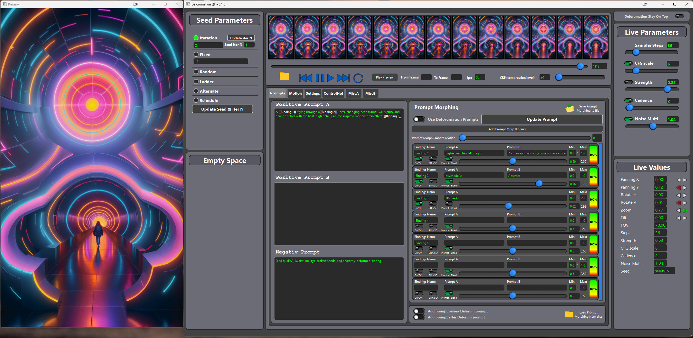
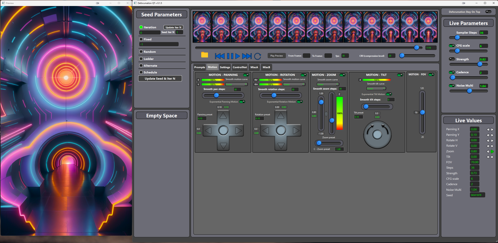
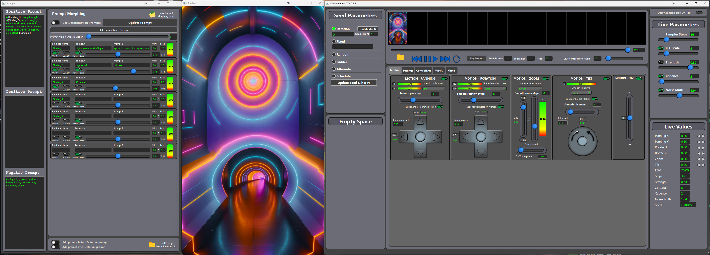
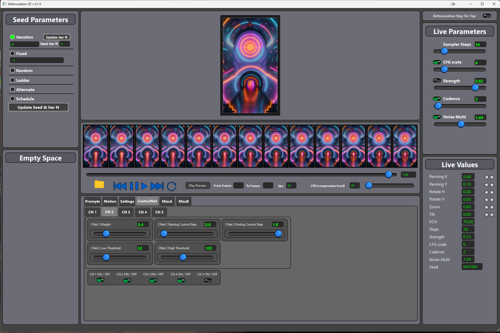
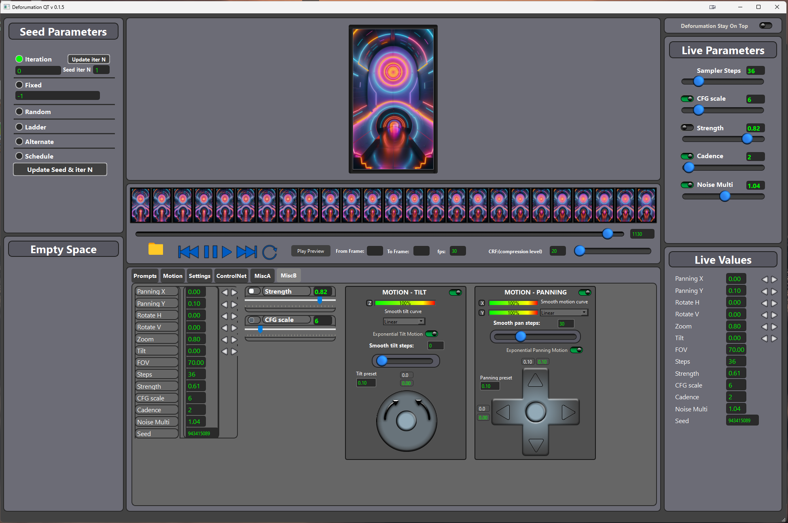
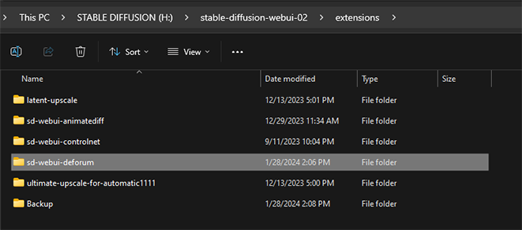

# DeforumationQT Version 0.1.8 #

This release includes:
Smooth motion to prompt morphing

Compatible with:

 SD Automatic1111
 
 And SD-Forged se https://github.com/Rakile/DeforumationQT/blob/main/Deforum_Version/sd-forged/Readme%20for%20sd-forge.txt for forge campability

Dynamical seeding

An alpha version of loop-backing , which can allow you to change the environment according to how you like it.

OSC support for prompt morphing, controled VIA bind name (See example in Examples folder: test_osc_prompt_morphing.py)

*BUG FIXES

## Live Prompting Tab

## Live Motions Tab

## Promp / morph / strenghts Tab

## Settings Tab

## Easy to change , save, restore and load Layouts.

## Live Controlnet Tab 

## Misc Tabs for customizable layouts

 # Video running DeforumationQT version 0.1.0 New video soon to arrive! #

Introduction
-----------------
DeforumationQT is an unofficial extension for Deforum that provides a Graphical User Interface (GUI)
to remotely control Deforum 3D motions, zoom and angle , strength value (toggle to use deforum strenght schedule)
CFG Scale, sampler steps, seed, cadense scale, noise values, parameters for use up to five controlnets, and prompts in real-time.
It also offers pausing, rewinding, forwarding, and resuming by setting current image to fix any undesired outcomes during the rendering process.

## Table of Contents
1. [Prerequisites](#prerequisites)
2. [Installation](#installation)
   - [Windows](#installation-windows)
   - [Linux](#installation-linux)
   - [Manual Installation](#manual-installation)
3. [Trouble Shooting](#trouble-shooting)
4. [Mediator Arguments](#mediator-arguments)
5. [DeforumationQT Arguments](#deforumationqt-arguments)
6. [Deforum Arguments](#deforum-arguments)
7. [Running Deforumation with OSC](#running-deforumation-with-osc)
8. [Further Help](#further-help)

## Prerequisites
- Automatic1111: Install and read instructions at [Automatic1111 GitHub](https://github.com/AUTOMATIC1111/stable-diffusion-webui).
- Deforum Stable Diffusion — official extension for AUTOMATIC1111's webui   [Deforum](https://github.com/deforum-art/sd-webui-deforum) 
- Python version 3.10.x: Download from [Python.org](https://www.python.org/downloads/).

## Installation

A more comprehensive installations guide is found in the "DeforumationQT_installation_guide.pdf" 

**Clone or download** the git repository  `git clone https://github.com/Rakile/DeforumationQT`  
Keep deforumation folder outside your `"stable-diffusion-webui"` path.
### Installation Windows
1. Navigate to the "Deforum_Version" folder.
2. Choose the communication method:
   - "piped" folder: Uses named pipes (recommended for local Windows).
   - "socket" folder: Uses websockets.
   - "hybrid" folder: Auto-selects based on OS.
3. Unpack the correct Deforum version zip ( piped, socket or hybrid ) to the Automatic1111 "extensions" folder. 
4. 
5. Make sure there is only one deforum folder inside the extensions folder.
6. Restart Automatic1111 if it was running.
7. Run "runme_windows_named_pipes.bat" or "runme_windows_websockets.bat".

### Installation Linux
1. Go to the "Deforum_Version" folder.
2. Copy "sd-webui-deforum" from the “socket” folder to the Automatic1111 "extensions" folder.
3. Restart Automatic1111 if it was running.
4. Install xterm: `sudo apt install xterm`.
5. Run `source runme_linux_websockets.sh` or `./runme_linux_websockets.sh`.

### Manual Installation
1. Ensure Python 3.10.xx is installed.
2. For Linux: Follow the provided steps to install Python 3.10.
3. Activate the virtual environment:
   - Linux & MacOS: `source ./venv/bin/activate`
   - Windows: `.\venv\Scripts\activate.bat`
4. Install requirements:
   - Linux & MacOS: `python -m pip install -r requirements_linux.txt`
   - Windows: `python -m pip install -r requirements_win.txt`
5. Start the mediator: `python mediator.py`
6. In a new terminal, start Deforumation: `python deforumation.py`

## Trouble Shooting
- Linux error with Qt platform plugin "xcb":
  - Install libxcb-cursor0: `sudo apt-get install libxcb-cursor0`
  - Run `python deforumation.py`

## Mediator Arguments
- Change listening addresses and ports:
  - For external traffic from Deforum: `python mediator.py "--mediator_deforum_address 0.0.0.0 -mediator_deforum_port 8765"`
  - For traffic between Deforumation and the mediator: `python mediator.py "--mediator_deforumation_address 0.0.0.0 -mediator_deforum_port 8766"`

## DeforumationQT Arguments
- Change listening addresses and ports for DeforumationQT:
  - `python deforumation.py "--deforumation_address 0.0.0.0 -deforumation_port 8767 --mediator_address 127.0.0.1 --mediator_port 8766"`

## Deforum Arguments
- Modify communication settings in `.../sd-webui-deforum/scripts/deforum_helpers/deforum_mediator.cfg`.
- Default: `ws://127.0.0.1:8765`
- If removed, the “Hybrid” version uses named pipes.

## Running Deforumation with OSC
- Windows: Run “runme_windows_named_pipes_osc.bat” or “runme_windows_websockets_osc.bat”.
- Linux: Run “runme_linux_websockets_osc.sh”.
- Manually: `python deforumation.py "--use_osc –osc_port 5005"`
- Default OSC port: 5005.
- Example OSC client: See “test_osc_client.py” in the Example folder.

## Further Help? Join our Discord server!
<a href="https://discord.gg/rbKFVh9v87"></img></a>

## Support our effort!
<a href="https://www.patreon.com/Deforumation"></img></a>
